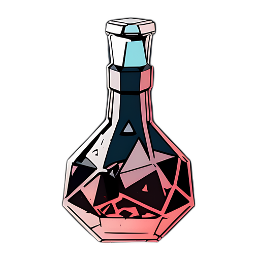
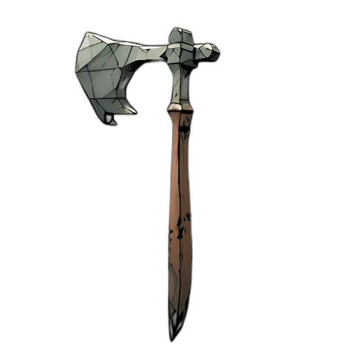
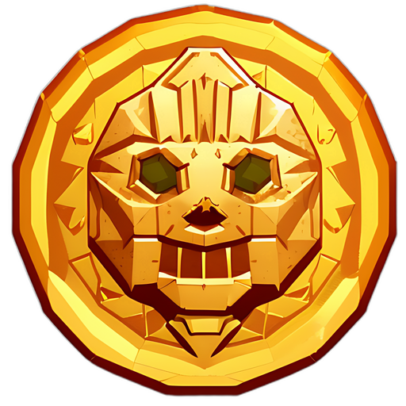
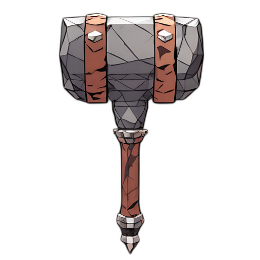

# Dungeon Master (A.K.A Dabloon's Lair) - Computer Graphics Project

## Thomas DUMONT

Projet de la matière synthèse d'image pour le Master 2 Informatique Sciences de l'Image

---

## Installation

- git clone https://github.com/0ctodice/Dungeon-Master-Computer-Graphics-Project.git (ou décompressez le fichier zip)
- cd src
- mkdir build
- cmake ..
- make
- ./project/project_main [nom du fichier data]

## Warning shader

Les shaders de ce projet utilise la version 330 core, si vous n'êtes pas sur de la version de votre opengl, je vous invite à metre cette ligne en commentaire et décommenter les deux ligne au dessus indiquant *#version 300 es* et *precision mediump float;*.

## Comment jouer

les déplacement se font avec les touches suivantes :

- Z : déplacement vers l'avant
- S : déplacement vers l'arrière
- Q : déplacement vers la gauche
- D : déplacement vers la droite
- A : rotation vers la gauche
- E : rotation vers la droite

Les interactions avec les monstres et les objets se font avec le clic gauche

## A. Données du donjon

### 1. Structure du niveau

La structure du niveau sera chargé à partir d'une image ppm qui n'est pas à modifié.
1 pixel = 1 tile.
Code couleur :

- noir : mur
- blanc : couloir / pièce vide
- bleu (#0000FF) : eau
- rouge (#FF0000) : entrée
- vert (#00FF00) : sortie

concernant la forme du fichiers PPM.
Le parser est basé sur le format fourmis en export par GIMP :

```txt
P3
# Created by GIMP version 2.10.30 PNM plug-in
5 4
255
0
0
0
0
...
```

### 2. Données d'un niveau

Pour gérer les données on partira d'un fichiers texte à parser suivant la logique ci-dessous :

- un commentaire qui commence par le signe "#"
- le nombre de niveaux
- sur chaque ligne suivante, la description d'un niveau sous cette forme :
  - nom du fichier ppm du niveau (à déposer dans le dossier assets/map):nombre de pièce à trouver
- le nombre de trésors
- Sur chaque ligne suivante, la description du trésors sous cette forme :
  - id(int):position.x(int):position.y(int):id du niveau:nom:type:valeur:texture2D(tout part du dossier assets/texture)
- le nombre de monstres
- Sur chaque ligne suivante, la description du monstre sous cette forme :
  - id(int):position.x(int):position.y(int):id du niveau:nom:type:atk:ca:pv:temps d'attente entre chaque action(float):nombre de pièce fournis à sa mort:texture2D(tout part du dossier assets/texture)

### Exemple :

```txt
#room
2
room.ppm:100
map.ppm:10
6
1:1:1:0:tune:1:120:dungeon/coin.png
2:1:3:0:sword:4:20:sword/sword004.png
3:2:1:0:shield:5:15:shield/shield020.png
4:2:3:0:popotte:2:10:dungeon/health.png
5:1:2:0:popotteMax:3:10:dungeon/maxhealth.png
6:2:2:0:poorKatana:4:999:sword/sword015.png
2
1:8:7:1:hand:2:0:10:1.0:10:monster/hand.png
2:8:6:1:octopus:2:0:10:1.0:10:monster/octopus.png
```

## B. Le personnage et sa mission

### Pour ce projet, le but du jeu est d'amasser une certaine somme d'argent, afin de pouvoir progresser entre les niveaux.

### Déscription des règles concernant le joueur :

- Le joueur possède 20 points de vie au début de la partie.
- Le joueur possède une valeur d'attaque (atk) de 1 à mains nue.
- Le joueur possède une classe d'armure (ca) de 0 sans protection.
- Le joueur commence avec 0 pièce d'or.
- Pour traverser une porte il faut avoir une certaine somme d'argent indiquer au joueur avant chaque niveaux.
- Tuer un monstre apporte une certaine somme.
- On peut ramasser des pièces, des armes, des boucliers ou des potions.
- chaque changement d'arme ou bouclier n'est pas définitif.

### Déscription des différents type d'objet :

1. Modification de l'argent posséder par le joueur
2. Modifie la santé du joueur
3. Modifie la santé MAX du joueur
4. Représente une arme de CAC
5. Représente une protection influant sur la CA
   
## 3. Monstres

L'intelligence artificielle des monstres sera très simple, tous les X temps soit ils avanceront vers le joueurs s'ils sentent sa présence à une certaines distance, soit ils attaqueront ce dernier au corps à corps, soit ils attendront.

Le temps entre chaque action pour un monstre donné est passer dans le fichier des données.

## 4. Représentation graphique

L'ensemble des textures du projet (mur, sol, plafond, porte, arme, interface, splashscreen) ont été généré par IA en utilisant Stable Diffusion : https://nmkd.itch.io/t2i-gui

Nous utiliseront pour l'ensemble du projet des quads texturés.

Pour l'illumination, nous utiliserons le modèle Lambert définie au niveau du joueur.

Pas de gestion des ombres.

## 5. Les spécifications implémentées

L'ensemble des spécifications demandés implémentées sont les suivantes :

1. Chargement de la carte : détermination du point d'entrée et de sortie
2. Chargement des trésors et des monstres ainsi que leurs caractéristiques
3. Affichage de la carte (des couloirs du donjon)
4. Navigation simple dans le donjon
5. Interaction avec les trésors : ramassage de trésors et modifications des caractéristiques du personnage
6. Intégration et visualisation des monstres dans le donjon
7. Comportement des monstres
8. Interaction avec les monstres : combat...

## 6. Les extensions proposées

### Collisions

Etant donné que nous conservons et mettons à jour les positions des tiles ainsi que la position du joueur, nous pouvons vérifier avant chaque déplacement la présence d'un mur et ainsi empêcher ce déplacement si besoin.

### Transparence

Ayant utilisé la technique des quads pour l'affichage, l'utilisation de png a été mis en place.

### Amélioration du comportement des monstres

Les monstres ont la possibilité de "sentir" la présence du jour sur un rayon de 4 tiles. Ils vont ainsi se diriger vers ce dernier en prenant en compte les murs autour de lui.

### Plusieurs niveaux

Le donjon peux comprendre plusieurs étages, pour cela, il est impératif de suivre la spécification du fichiers des données (ci-dessus).
De plus, bien qu'on charge l'ensemble des monstres et trésors, on ne charge seulement qu'un seul niveau à la fois. Les monstres et trésors n'appartenant pas à l'étage courant n'est ni modifié ni afficher.

### Amélioration des interactions

Plusieurs interactions on été amélioré :

- Lorsque le joueur possède suffisamment de pièce d'or, lorsqu'il cliquera sur la porte, cette dernière s'ouvrira et sera animé.
- Les monstres possèdent une caractéristique de vitesse, passé dans le fichier de données. On peut donc avoir des monstres qui tape ou se déplace 2 fois plus vite que d'autre mais feront moins de dégâts.
- Le héro possède un "inventaire", il peut conserver sur lui une arme defensive et offensive qu'il peut échanger à tout moment avec d'autre armes dans le niveau. Ce changement n'est pas définitif.

### Splashscreen

Il existe quelques splashscreens dans le projet :

- gamestart, présentant le jeu
- gameover, indiquant la mort du joueur
- treasure, indiquant le nombre de pièce d'or que doit obtenir le joueur pour passer une salle du niveau
- theend, félicitant le joueur d'avoir fini le jeu

## 7.  Résumé des classes développés pour le projet

### Toutes ces classes sont présente dans le dossier glimac

- **Character** : classe mère pour **Player** et **Monster**
- **DataParser** : classe parsant les fichiers de données et stockant/gérant/affichant l'ensemble des **Entity** et infos des niveaux
- **Entity** : classe mère pour **Monster** et **Treasure**
- **HUD** : classe gérant les données de l'interface ainsi que son affichage
- **MapGenerator** : classe tockant/gérant/affichant l'ensemble des **Tile** du niveau courrant
- **MatrixManager** : classe gérant une Model View Matrix (donc gérant les translation/rotation/homothétie)
- **Monster** : classe gérant les infos et la temporisation des actions d'une instance de monstre
- **Player** : classe gérant les infos de l'instance de joueur
- **PPMParser** : classe pouvant parser un fichier ppm et stocker ses infos
- **SixAdjacencyCamera** : classe gérant les déplacement de caméra
- **Texture** : classe gérant le bind/debind de texture
- **Tile** : classe stockant la position d'une tile ainsi que son état (indiquant s'il doit être afficher ou non)
- **TileSet** : classe stockant un set de tile ainsi que l'orientation qu'elles doivent avoir, de plus gère leur affichage
- **Treasure** : classe gérant les infos d'un trésor.

## 8. Assets

les assets utilisable sont présentes dans le dossier assets dispatché dans l'architecture suivante :
- Data : dossier contenant tout les fichiers texte avec l'ensemble des infos du niveau.
- map : dossier ciblé par le projet pour récupéré les fichiers ppm.
- textures : dossier avec toutes les textures du projet.

### Bonus : petit showroom de quelques assets

### Trésors






### Monstres


